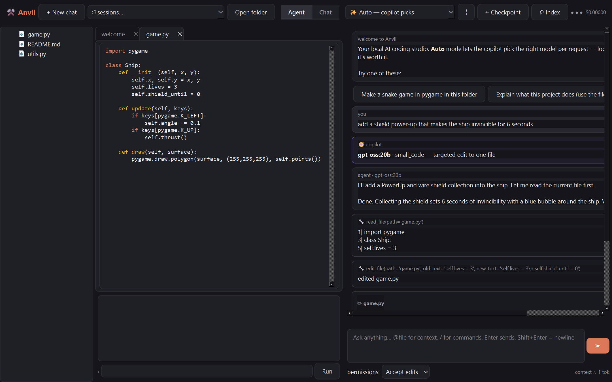
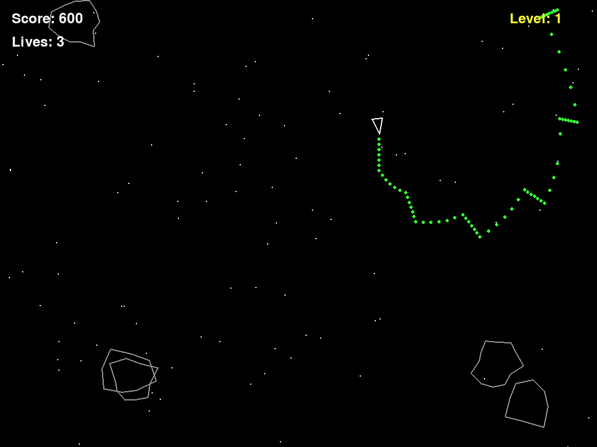

<div align="center">

# ⚒ Anvil

### A native local AI coding studio — Cursor + Claude Code, running your own models

Most of your coding happens **locally and free**. Anvil escalates to paid API models
only when it actually helps — and a built-in **frontier-model reviewer** checks the
local model's code and loops fixes until it passes. No browser. No Electron. One `.exe`.

[](https://github.com/jakerusso100-ai/Anvil/releases/latest)


</div>



---

## Why Anvil?

Cursor and Claude Code are excellent — but they route your work to paid cloud models
by default. Anvil flips that: benchmark-selected **local models handle most coding for
$0**, and paid models are an opt-in escalation, not the default. On everyday tasks the
local models land within a few points of the frontier; on one benchmark a local model
*matched* it outright. When a task is genuinely hard, a paid reviewer catches the local
model's mistakes for fractions of a cent.

You get the full IDE-agent experience — agent tools, diff review, permission modes,
semantic search, an editor with tab-autocomplete and a terminal — on your own hardware.

## Download

Grab **`Anvil.exe`** from the [**latest release**](https://github.com/jakerusso100-ai/Anvil/releases/latest) —
single file, no install, no Python required.

- [Ollama](https://ollama.com) running locally (for the local models)
- `ANTHROPIC_API_KEY` in your environment *(optional — enables the paid reviewer & API models; local coding works fully without it)*

Or run from source: `py -3.14 desktop/main.py`

## Features

**Agent mode** — the model uses real tools:

| | |
|---|---|
| 📁 Files | read / write / edit, confined to the workspace |
| 💻 Shell | run commands (GUI programs auto-run headless — can't hang the agent) |
| 🌐 Web | search + fetch — local models get internet like Claude |
| 🔍 Codebase search | semantic (embeddings) search by meaning, not keywords |
| 🧠 Memory | the agent saves learnings that reload every session |
| 👥 Subagents | delegate focused subtasks to keep context clean |
| 🔌 MCP | connect any Model Context Protocol server |
| 📓 Obsidian | search / read / write your notes vault |

...with **permission modes** (Ask / Accept edits / Plan / Bypass), **diff-preview
approvals**, red-green **diff cards** with Accept/Reject, and one-click **checkpoint
revert**.

**Reviewed builds** — when a local model finishes building (files written, self-test
run), a **paid reviewer (Opus/Fable/Haiku) checks the result** and loops concrete fixes
back into the agent automatically. Local does the work; the frontier model does the QA —
zero human intervention, and fully toggleable.

**Chat mode** — a local model writes the code, a paid model reviews it, and the local
model auto-fixes using the reviewer's guidance. All toggleable; live cost meter.

**Auto copilot routing** — a fast local model classifies each request and picks the
right specialist; redirects on failure; live health monitoring.

**Editor** — file tree, tabs, syntax highlighting, **Tab-autocomplete** (fill-in-middle),
**live-sync** when the agent edits an open file, and an integrated **terminal**.

**Sessions** persist and resume across restarts.

See [`FEATURES.md`](FEATURES.md) for the full Cursor/Claude Code parity matrix.

## What it builds

These two programs were built by Anvil agents **end-to-end from a non-coder's plain-English
prompt, with zero human intervention** — auto-routed to a local model, self-tested headless,
verified working. ([`examples/`](examples/))

| "space game like asteroids but better" | "a 3D maze game" | "a 3D space flying game" |
|:---:|:---:|:---:|
|  |  |  |
| asteroids that split, UFOs, power-ups | raycasting engine · first-person · minimap | perspective projection · depth-scaled obstacles |

*(A Minecraft-style Panda3D voxel builder is in [`examples/`](examples/) too.)*

## Model roster

Chosen by a benchmark suite, not by vibes:

| Role | Model |
|---|---|
| Fast daily coding | `gpt-oss:20b` |
| Whole-app building | `qwen3-coder-next` |
| Vision | `qwen3-vl:8b` |
| Copilot router | `granite4` |
| Tab autocomplete | `qwen2.5-coder` |
| Semantic search | `nomic-embed-text` |
| Paid escalation | Haiku → Sonnet → Opus / Fable |

Remote OpenAI-compatible providers (OpenRouter, z.ai) are wired in too — GLM-5.1,
MiniMax-M2.5, DeepSeek all work in agent mode with a key.

## Project layout

| Path | What |
|---|---|
| `backend/` | agent loop, tools, model adapters, copilot router, semantic index, MCP, sessions |
| `desktop/` | PySide6 GUI + shared pipeline |
| `tests/`   | 99-test suite (units, security, GUI, agent protocol, failure-path guards) |
| `examples/`| programs Anvil agents built from non-coder prompts |
| `docs/`    | screenshots |

## Build the exe yourself

```powershell
py -3.14 -m pip install pyinstaller
py -3.14 -m PyInstaller --noconfirm --onefile --windowed --name Anvil ^
  --paths desktop --paths backend --collect-submodules anthropic ^
  --collect-submodules ddgs --collect-submodules mcp --add-data "providers.json;." ^
  --exclude-module PyQt5 --exclude-module PyQt6 desktop/main.py
```

## Tests

```powershell
for %t in (test_anvil test_round2 test_round3 test_round4 test_round5 test_round6 test_round7) do py -3.14 tests\%t.py
```

---

<div align="center">
<sub>Built with local models, benchmarked, stress-tested, and shipped. MIT-spirited — do what you like.</sub>
</div>
